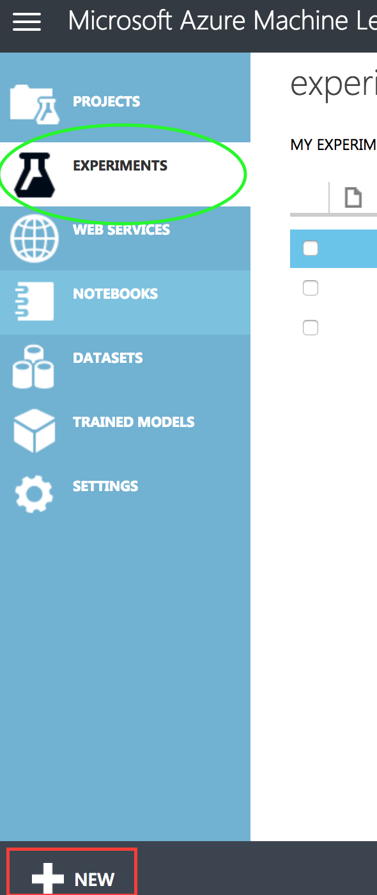

# Getting the Data
Using the [diabetes dataset posted in this folder](dataset_diabetes/diabetic-deliver.csv), download the file onto your machine (this
is the only mechanism that Azure ML Studio gives us to get data up). Is this ideal? Is there a better way to do this?

One the data is on your machine, let's get it into Azure ML Studio:

1. Sign in to [Azure Machine Learning Studio](https://studio.azureml.net/).
2. Using the menu on the left-hand side of the page, click on Datasets.

3. Use the new button at the bottom left (red box), click `New`.
4. Navigate to the location where the data was saved. 
5. Save the dataset [diabetic-deliver]('./dataset_diabetes/diabetic-deliver.csv') as `diabetic-deliver.csv`.
6. Under `Select a type for the new dataset`, choose `Generic CSV file with header`.
7. Click the encircled check mark to upload.
8. Wait, this could take up to 1 minute.
9. Finally, you should see the dataset (named) in the panel.