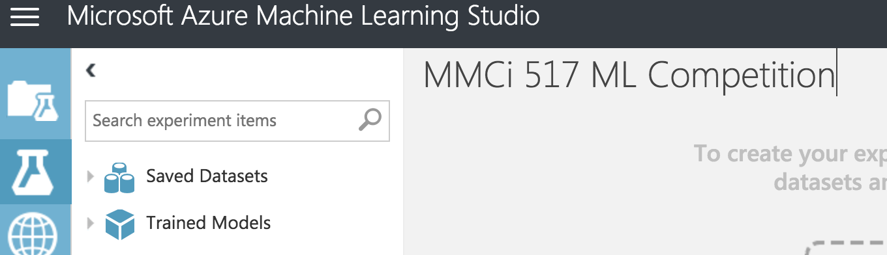
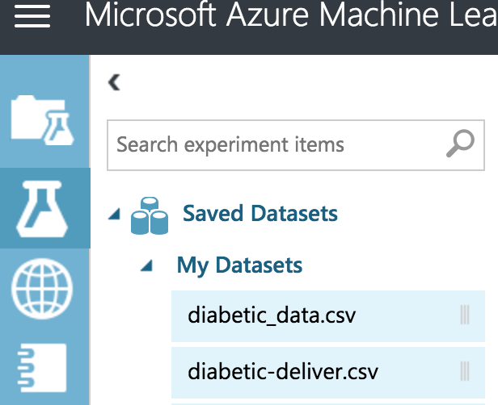

# Creating the experiment in ML Studio
First, within Azure Machine Learning Studio, we'll need to create
a new experiment. Let's do that now.

1. Log into [Azure Machine Learning Studio](https://studio.azureml.net/).
2. Click on the experiment tab on the left-hand side (green circle): 
  
3. At the bottom of the image above, note the red box, click that to create new.
4. Now, click `Blank Experiment`, and then give it the name `MMCi 517 ML Competition`. 

5. Now, let's load our data into the experiment. 

6. Click and drag the data set `diabetic-deliver.csv` into the workspace.
7. Now, in order to save this experiment, we need to add one `module`. Something that
does something to the data.
8. We'll first just extract some columns. To get this module, we will go to the search
pane and type in `select columns`. This type-ahead utility will help us narrow down modules that are
useful in building our pipeline.

9. Click and drag the appropriate module into the workspace.
9. Now, let's connect our data to this module. Click on the first box and drag
 a line to this new module.
10. At this point, we can save our experiment.
11. Save and quit.